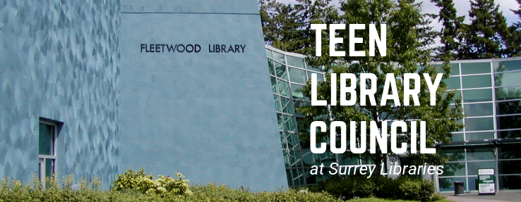

## Teen Library Council at Surrey Libraries

### Experience Summary:
* Role: Head Leader
* Involvement Duration: Aug. 2016 - Aug. 2019
* Affiliated Organization: Surrey Libraries, Fleetwood Branch
* Purpose: spearheaded diverse city-wide events with a budget of $5,000
* Team size: 20+
* Most Notable Event: Surrey Youth STEM Challenge, which was voted the best-attended teen event in the history of Surrey Libraries
* Team Leadership: Established a dynamic committee with streamlined online communications within the council to facilitate group synergy which increased event attendance by 500%
* External Leadership: Featured as the keynote speaker at the Surrey Youth Leadership Conference

[Media Feature](https://voiceonline.com/surrey-youth-embrace-stem-challenge-at-surrey-libraries/)

[Facebook Page](https://www.facebook.com/tlcfleetwood/)

[Instagram Page](https://www.instagram.com/tlcfleetwood/)
