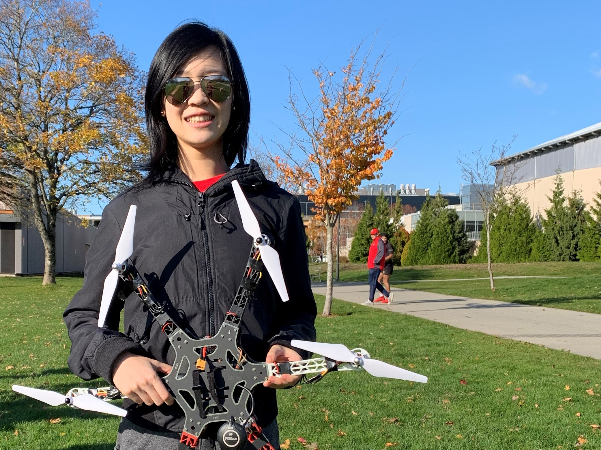

## About Me

**Robots are my passion.** On top of a full course load, I work as a robotics researcher for [UBC Collaborative Advanced Robotics and Intelligent Systems (CARIS) Lab](https://caris.mech.ubc.ca/). I am a payload designer on UBC Unmanned Aircraft Systems developing drone systems and unmanned ground vehicles. I also founded and currently lead the [Surrey Robotics Innovation Lab](https://surreyroboticsinnovationlab.ca/), a community organzation to empower youth in robotics.

  
  
  

### Links

- [What is Robotics? With Engineering Student Sophie Lin - UBC Geering Up](https://www.youtube.com/watch?v=LW0tiQdmUns)
- [EGBC Innovation Magazine Feature](https://user-yinucac.cld.bz/INNOVATION-July-August-20201/20/)
