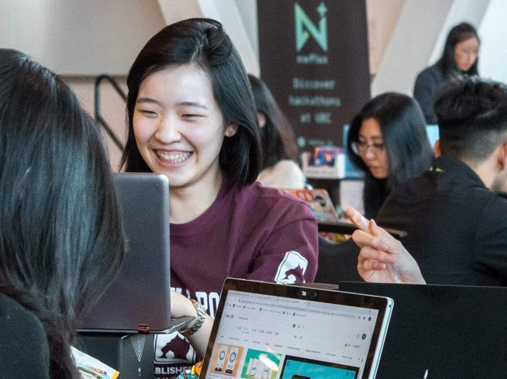

## About Me

**I have a passion for leading edge technologies and the ability to learn extremely quickly.** I worked 8 months at Intel as ASIC Design and Verification Automation Co-op. On top of a full course load, I worked as a robotics researcher for [UBC Collaborative Advanced Robotics and Intelligent Systems (CARIS) Lab](https://caris.mech.ubc.ca/). I am a payload designer on [UBC Unmanned Aircraft Systems](https://www.ubcuas.com/) developing drone systems and unmanned ground vehicles. I also founded and currently lead the [Surrey Robotics Innovation Lab](https://surreyroboticsinnovationlab.ca/), a community organzation to empower youth in robotics.

|      |        |      |

I'm from Vancouver BC, and my hobbies include longboard dancing, photography, oil painting, basketball, oboe, and skiing.

*Stanely Park, Vancouver BC - by Sophie Lin*

---

### Links

- [EGBC Innovation Magazine Feature](https://user-yinucac.cld.bz/INNOVATION-July-August-20201/20/)
- [What is Robotics? With Engineering Student Sophie Lin - UBC Geering Up](https://www.youtube.com/watch?v=LW0tiQdmUns)
