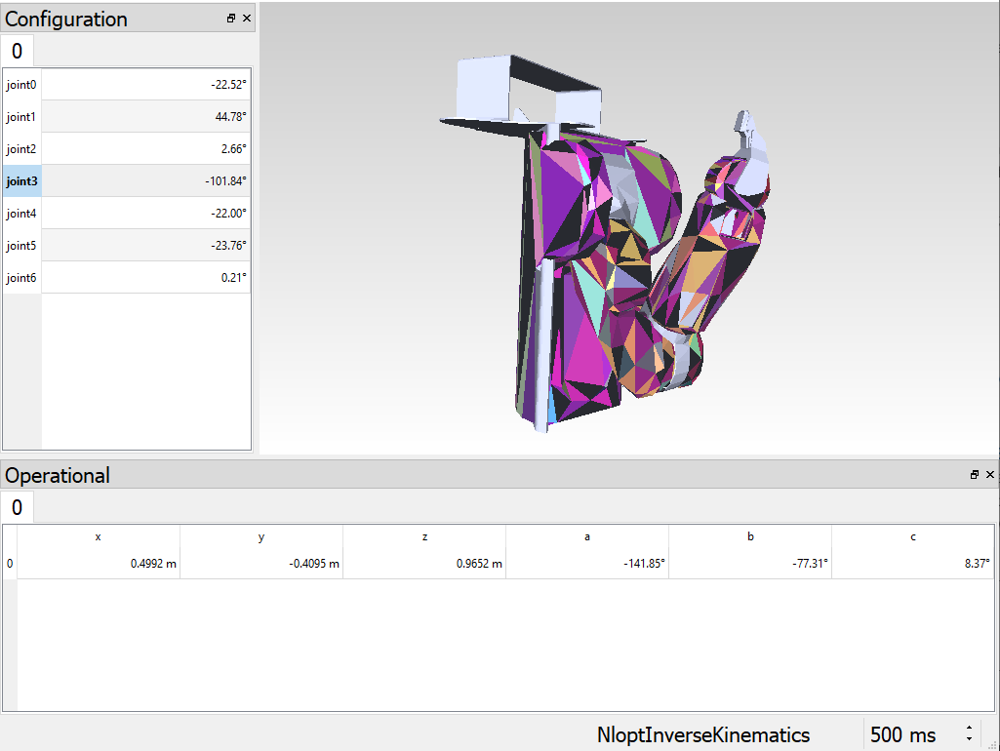
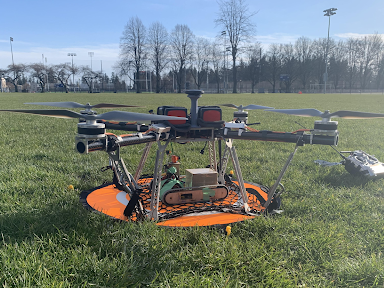
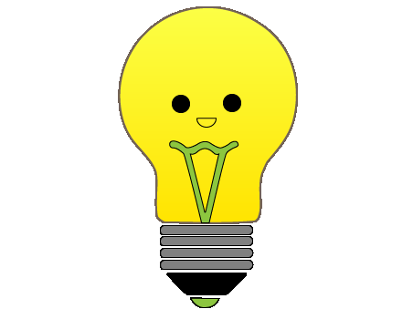

# Welcome! 

## I document my projects and experiences here.

---

### Featured Projects

| <a href="/pr2"> Robotics Library Model of the PR2  </a>      | <a href="/rhino"> Rhino - Unmanned Ground Vehicle  </a>       | <a href="/savee"> Household Energy Conservation App  </a>       |

---

### Media Features

- [EGBC Innovation Magazine Feature](https://user-yinucac.cld.bz/INNOVATION-July-August-20201/20/)
- [What is Robotics? With Engineering Student Sophie Lin - UBC Geering Up](https://www.youtube.com/watch?v=LW0tiQdmUns)

