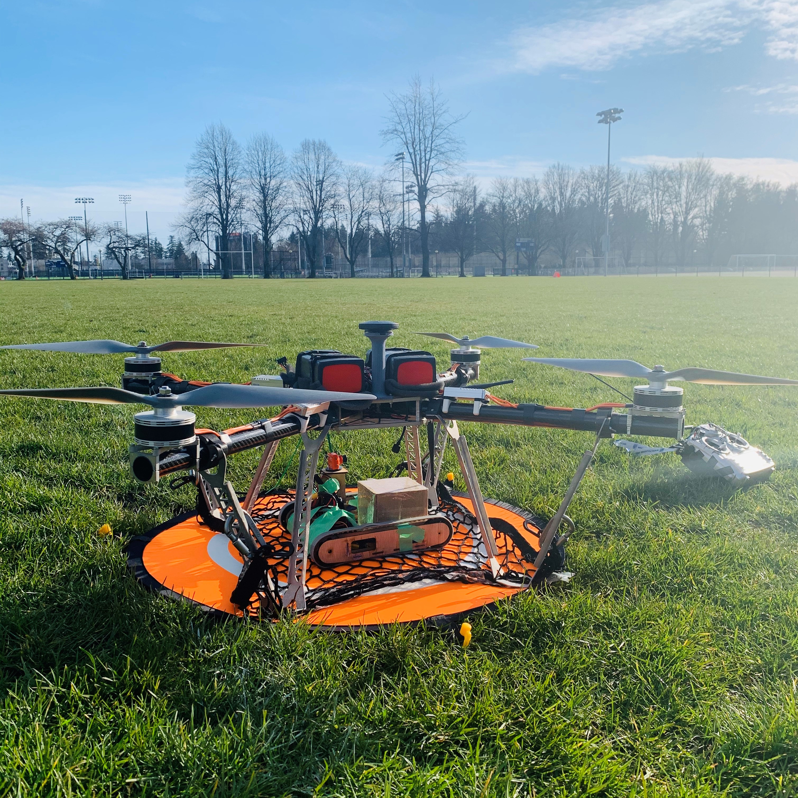
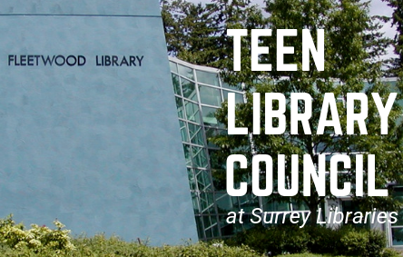

# Welcome! 
## I document my projects and experiences here

---

### Featured Projects

<a href="/pr2">
   Robotics Library Model of the PR2
   
</a>

---
<a href="/rhino">
   Rhino - Unmanned Ground Vehicle
   
</a>

---
<a href="/VEX2019">
   2019 VEX Robotics Turning Point Competition
    
</a>

---

### Community Impact
<a href="/SRIL">
   Surrey Robotics Innovation Lab
    
</a>

---
<a href="/TLC">
   Teen Library Council
    
</a>

