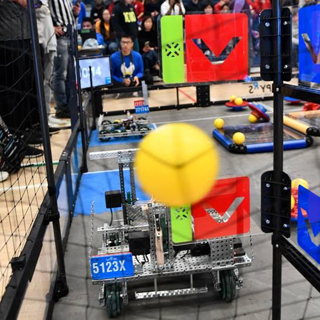

# Welcome! 
## This is where I document my projects and experiences

---

### Projects

<a href="/pr2">
   Robotics Library Model of the PR2
   
</a>

---
<a href="/rhino">
   Rhino - Unmanned Ground Vehicle
    
</a>

---
<a href="/VEX2019">
   2019 VEX Robotics Turning Point Competition
    
</a>

---

### Community Impact
<a href="/SRIL">
   Surrey Robotics Innovation Lab
    
</a>

---
<a href="https://voiceonline.com/surrey-youth-embrace-stem-challenge-at-surrey-libraries/">
   Surrey Youth STEM Challenge - Teen Library Council
    
</a>

---

### About Me

- [What is Robotics? With Engineering Student Sophie Lin - UBC Geering Up](https://www.youtube.com/watch?v=LW0tiQdmUns)
- [EGBC Innovation Magazine Feature](https://user-yinucac.cld.bz/INNOVATION-July-August-20201/20/)

