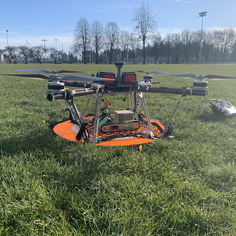

## Portfolio

---

### Technical Projects 

[Rhino - Unmanned Ground Vehicle](/rhino)

---
[2019 VEX Robotics Turning Point Competition](/VEX2019)

---
[Project 3 Title](http://example.com/)

---

### Leadership Projects 

[Summer 2020 STEM Workshop Series](/pdf/SRIL2020workshops.pdf) - [Surrey Robotics Innovation Lab](/SRIL)

---
[Surrey Youth STEM Challenge - Teen Library Council](https://voiceonline.com/surrey-youth-embrace-stem-challenge-at-surrey-libraries/)

---

### Features

- [What is Robotics? With Engineering Student Sophie Lin - UBC Geering Up](https://www.youtube.com/watch?v=LW0tiQdmUns)
- [EGBC Innovation Magazine Feature](https://user-yinucac.cld.bz/INNOVATION-July-August-20201/20/)

