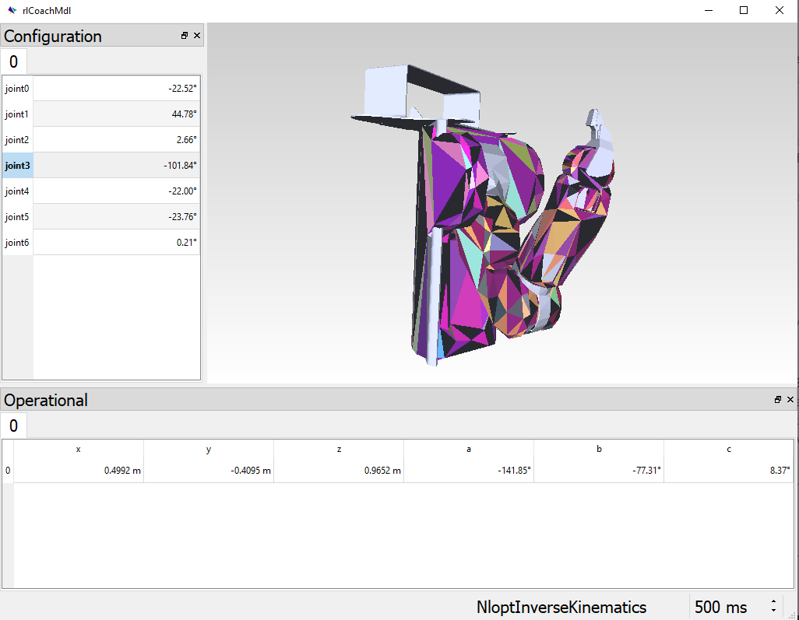
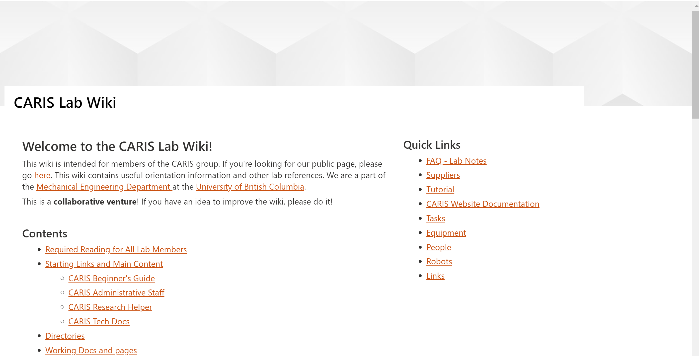
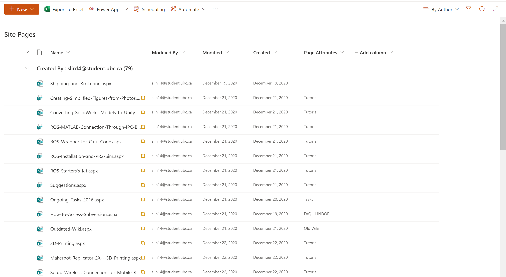

## Robotics Library Model of the PR2
### Project Summary:
* Affiliated Group: UBC Collaborated Advanced Robotics and Intelligent Systems Lab ([UBC CARIS Lab](https://caris.mech.ubc.ca/))
* Position: Resesarch Assistant (Full-Time: May-Aug. 2020, Part-Time: Sep.-May 2020)
* Independent and Team-based work
* Features: Robotics Library (RL) model of the PR2 robot arm, Gazebo, ROS, TrajOpt, SharePoint Lab Wiki Site
* Result/Status: RL model complete and implemented. Currently working with TrajOpt in ROS catkin workspace. SharePoint Lab Wiki Site developed.

### Technical Development Summary

* Key Skills Developed: Robot Kinematics and Dynamics, Resesarch, ROS, Gazebo, Linux-Ubuntu, MATLAB, SolidWorks, Software Installation, Debugging, Machine Learning
* Key Challenges: Testing and troubleshooting model's accuracy
* Primary Software Used: ROS, Robotics Library, Linux-Ubuntu

---
### Technical Communication Projects Summary

* Key Skills Developed: Technical Communication, Website Design and Development, Research, Citation, Documentation
* Primary Software Used: WordPress, SharePoint, Wiki, Common File Types

  
  

