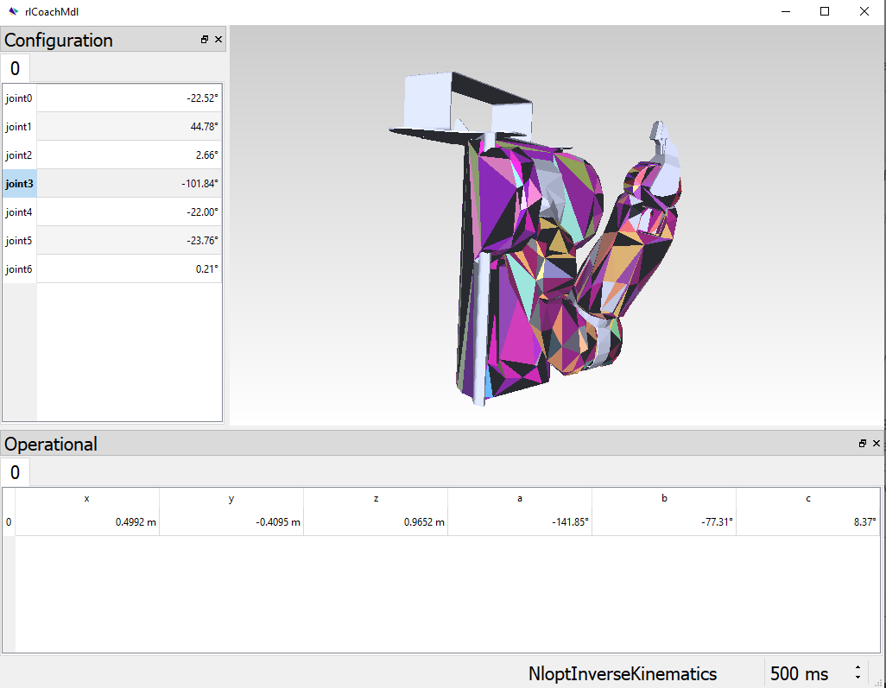
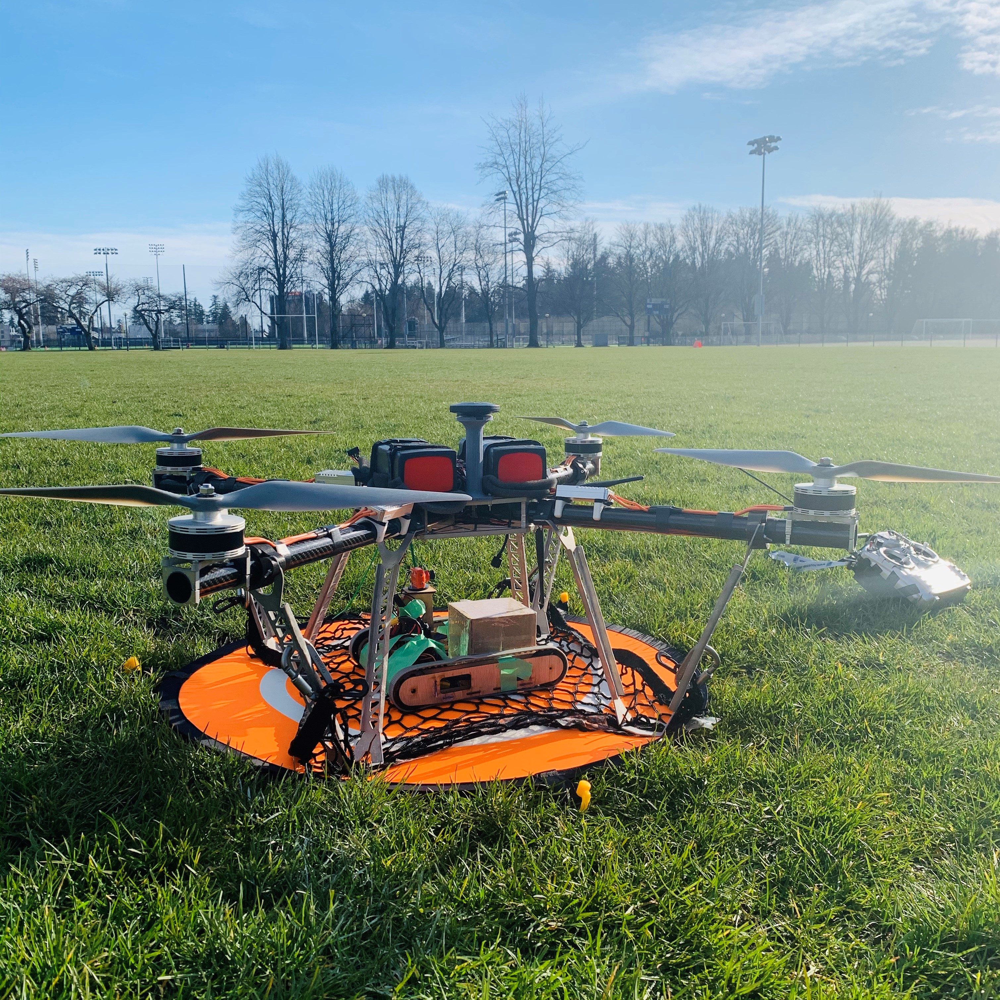
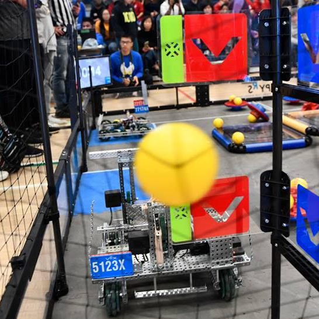
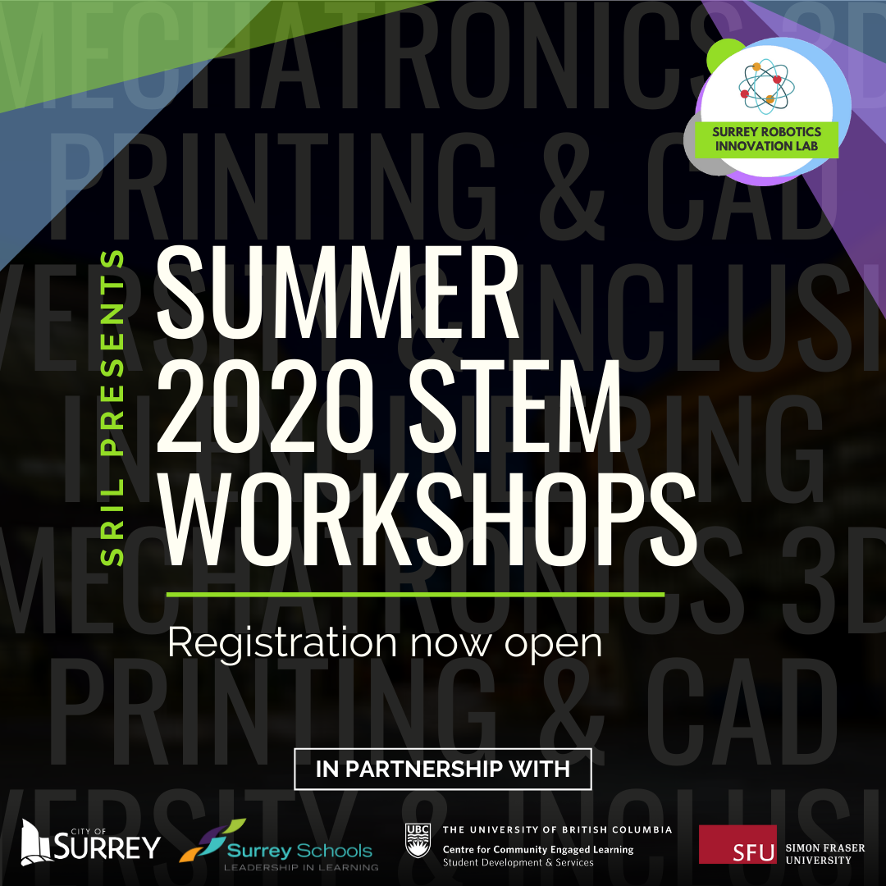
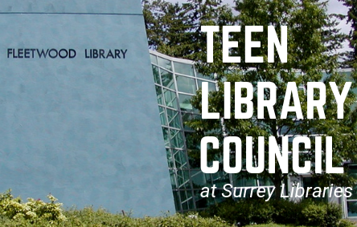

## Projects

---

### Technical Projects 

| <a href="/pr2"> Robotics Library Model of the PR2  </a>      | <a href="/rhino"> Rhino - Unmanned Ground Vehicle  </a>       | <a href="/pr2"> Robotics Library Model of the PR2  </a>       |

---
|      |        |        |

---
<a href="/pr2"> Robotics Library Model of the PR2  </a>

---
<a href="/rhino"> Rhino - Unmanned Ground Vehicle  </a>

---
<a href="/VEX2019"> 2019 VEX Robotics Turning Point Competition  </a>

---

### Community Projects 

<a href="/SRIL">
   Surrey Robotics Innovation Lab
    
</a>

---
<a href="/TLC">
   Teen Library Council
    
</a>

---

### Features

- [What is Robotics? With Engineering Student Sophie Lin - UBC Geering Up](https://www.youtube.com/watch?v=LW0tiQdmUns)
- [EGBC Innovation Magazine Feature](https://user-yinucac.cld.bz/INNOVATION-July-August-20201/20/)
