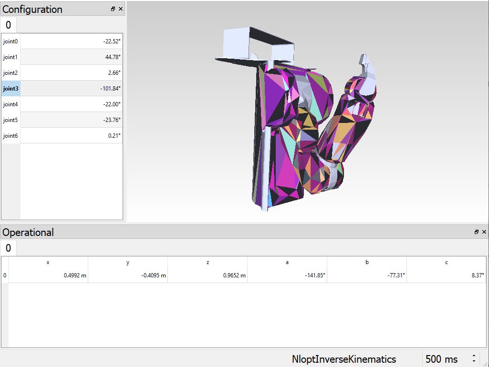
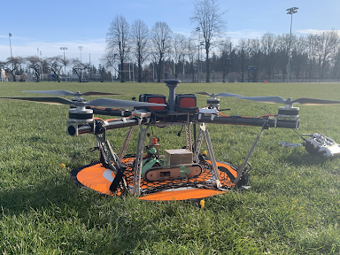
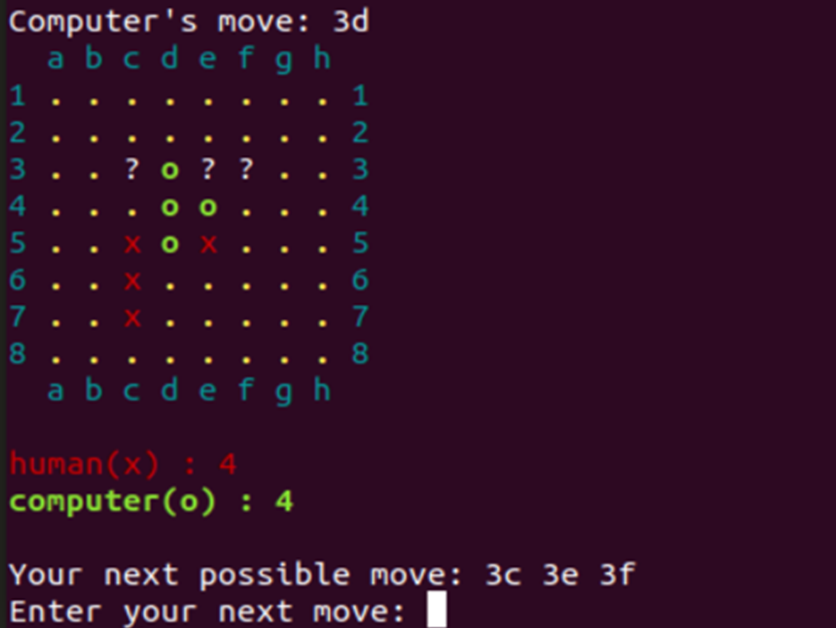

## Projects

---

### Technical Projects 

| <a href="/pr2"> Robotics Library Model of the PR2  </a>      | <a href="/rhino"> Rhino - Unmanned Ground Vehicle  </a>       | <a href="/savee"> Household Energy Conservation App  </a>       |

| <a href="/VEX2019"> 2019 VEX Robotics Turning Point Competition  </a>      | <a href="/VEX2018"> 2018 VEX Robotics In the Zone Competition  </a>       | <a href="/VEX2017"> 2017 VEX Robotics Starstruck Competition  </a>       |

| <a href="/pedestrian"> Vehicle Detection for Pedestrian Safety  </a>      | <a href="/reversi"> Reversi Game: Human vs Computer  </a>       | <a href="/shad"> Line-Following and Toy Gun Firing Robot  </a>       |

---

### Community Projects 

| <a href="/SRIL"> UAV Mechatronics  </a>      | <a href="/SRIL"> 3D Printing and CAD  </a>       | <a href="/SRIL"> Leadership in EDI  </a>       |

| <a href="/SRIL"> Robotics Today for Grade 9 Girls  </a>      | <a href="/TLC"> Surrey Youth Leadership Seminar  </a>       | <a href="/TLC"> Surrey Youth STEM Challenge  </a>       |

---

### Features

- [What is Robotics? With Engineering Student Sophie Lin - UBC Geering Up](https://www.youtube.com/watch?v=LW0tiQdmUns)
- [EGBC Innovation Magazine Feature](https://user-yinucac.cld.bz/INNOVATION-July-August-20201/20/)
