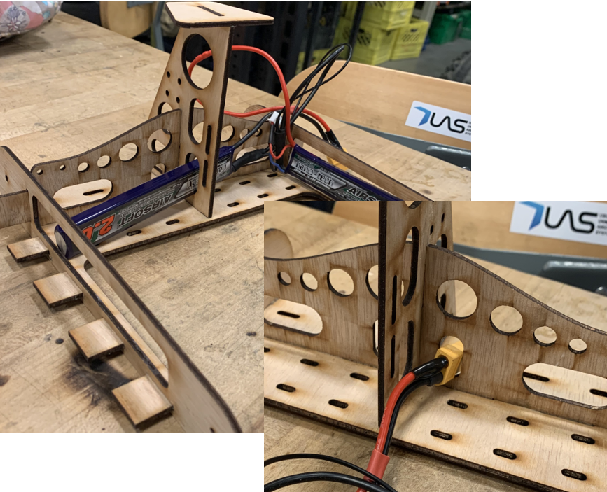

## Rhino - Unmanned Ground Vehicle

### Project Summary:
* Affiliated Group: UBC Unmanned Aircraft Systems ([UBC UAS](https://www.ubcuas.com/))
* Purpose: To develop a fully autonomous unmanned ground vehicle (UGV) capable of retrieving medical packages identified by QR codes and delivering the packages to the drone. Additionally, develop the mechanisms to secure the UGV and packages to the drone during flight and release them at the landing sites. All objectives needed to be accomplished while maintaining a lightweight design and meeting the space and aerodynamic requirements of the payload system of the aircraft.
* Team size: 5
* Features: Innovative tracked, remote-controlled, lightweight and compact design, complete with PWM circuit containing first-person video camera and transmitter, receiver, motors, remote-controlled switch, and lasers
* Result/Status: Project complete and implemented. Currently going through redesign for the [2021 Unmanned Systems Canada competition](https://www.unmannedsystems.ca/home/students/student-competition-details/).

### Technical Development Summary

* Key Skills Developed: Rapid Prototyping, Project Management, Mechanical Design with Integrated Electronics, 3D Modelling, Design Optimization through Prototyping, 3D Printing, Laser Cutting, Materials Selection, Hand Tools
* Key Challenges: PWM signal mixing for bidirectional remote control, payload and aircraft system integration
* Primary Software Used: OnShape and Solidworks
* Manufacturing Methods Used: FDM 3D Printing, Laser Cutting, Hand Tools, Waterjet Cutting
* Materials Used: PLA, TPU, Plywood, Aluminum

---
### Design Process

**Payload Deployment System**
I conceptualized the “net” - a simple, secure, and lightweight method of deployment and retrieval. I led my sub-team to test the concept with a toy tank.

  
  

**Detailed Design and Rapid Prototyping**
I designed the chassis on OnShape with electronics integration in mind. I manufactured using 3D printing and laser cutting. The batteries, XT60 connectors and wires fit perfectly through the holes.

  
  

**Design Feasibility Modeling**
I modeled torque and energy draw on Excel to determine the feasibility of motors and batteries for the mission requirements. The results helped inform which motors and batteries to purchase.

  
  

**Electrical Design and Testing**
I designed 40% of the electrical circuit, including voltage dividers to decrease the voltage for the lasers and RC switch to not exceed their maximum voltage ratings. I tested the entire electrical circuit. After discovering issues with the signal, I investigated using the multimeter and oscilloscope. The problem was associated with irregular PWM signals from a faulty receiver; I replaced the receiver and resolved the issue.

  
  

**Remote Control Programming with Microcontroller**
I programmed the RC control on an Arduino Nano to map the 3 PWM input channels from the receiver to the 2 PWM output channels to the motor controllers. This enabled full bidirectional control with pivot and differential steering.

  

**System Integration and Mission Testing**
I led my sub-team to test the system by simulating the mission objectives. We performed tests including payload deployment and retrieval, flight, and endurance out of line of sight using only the first-person video system for visual guidance.

  
  

